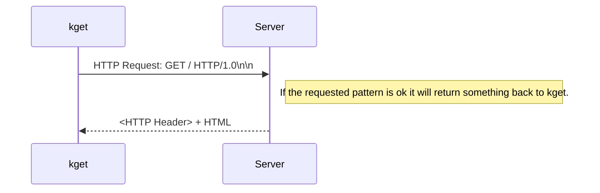

## Simple HTTP Client in C++
kget is a simple HTTP request programme. We can run kget <url> to get the web page eg. $kget [www.google.com](http://www.google.com), kget will return the html page back but in the text form.

## Install Boost Library
  
    $sudo apt update

    $sudo apt install libboost-all-dev

## **How to compile kget**

    $g++ kget.cpp -o kget -lboost_regex

## Run kget

    kget <url>
    
    For Example.
    $kget
    or
    $kget www.google.com

 
 
## kget Diagram

